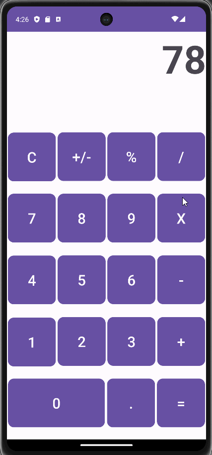

# Project 2: Basic Calculator Upgrade

An Android app for a simple calculator, for C323 Android Mobile Development.
It has addition, subtraction, multiplication, division, decimals, a percent button, a negative button, and a clear button.
It now also has a landscape layout, featuring sine, cosine, tangent, log 10, and natural log.

## Functionality 

The following **required** functionality is completed:

* [ ] User can enter a number (displayed on the top)
* [ ] User can choose an operation and choose another number
* [ ] User can choose another operation or equals to view the result
* [ ] User can clear everything with C button
* [ ] User can make numbers negative or positive with +/-
* [ ] User can choose % to divide the current number by 100.
* [ ] User can choose a trigonometric operation (sine, cosine, or tangent) and apply it to the number in radians
* [ ] User can choose a log 10 or natural log operation and apply it to the current number

The following **extensions** are implemented:

* I didn't implement any extensions for this project.

## Video Walkthrough

Here's a walkthrough of implemented user stories:

GIF created with [LiceCap](http://www.cockos.com/licecap/).

## Notes

The constraint layout was frustrating because the design view wouldn't match what actually displayed on the device for some reason, it needed tweaking to make it fit.

## License

    Copyright [2023] [Billy Moore]

    Licensed under the Apache License, Version 2.0 (the "License")
    you may not use this file except in compliance with the License.
    You may obtain a copy of the License at

        http://www.apache.org/licenses/LICENSE-2.0

    Unless required by applicable law or agreed to in writing, software
    distributed under the License is distributed on an "AS IS" BASIS,
    WITHOUT WARRANTIES OR CONDITIONS OF ANY KIND, either express or implied.
    See the License for the specific language governing permissions and
    limitations under the License.
